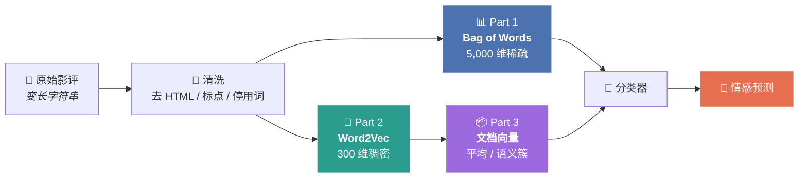

<div align="center">


# GYT · NLP Developing

**从词频统计到大模型 Embedding —— 一条可运行的 NLP 表示学习路径**

[](https://www.python.org/)
[](https://scikit-learn.org/)
[](https://radimrehurek.com/gensim/)
[](https://www.kaggle.com/competitions/word2vec-nlp-tutorial)
[](tests/)

</div>

---

<div align="center">



</div>

## 这个仓库是什么

Kaggle 入门教程 [**Bag of Words Meets Bags of Popcorn**](https://www.kaggle.com/competitions/word2vec-nlp-tutorial)
的 Python 3 完整复现。原教程写于 2014 年、基于 Python 2.7，代码在今天的环境里
**已经跑不起来**（`print` 语句、`sklearn.cross_validation`、gensim 3.x API 全部失效）。

本仓库做了三件事：

1. **把三个部分全部迁移到 Python 3** 并在真实数据上跑通，README 里的每个数字都是实测值；
2. **把「词向量怎么演化成大模型 Embedding」讲清楚**，包括原教程刻意回避的那些局限；
3. **提供可直接导入 Kaggle 的 Notebook**，附一份 Kaggle 免费算力的使用与避坑笔记。

任务本身很简单：根据 IMDB 影评文本判断情感是正面还是负面（25,000 条训练 / 25,000 条测试）。
但它是理解 NLP 表示学习的最佳入口。

## 实测结果

在 25,000 条标注影评上按 8:2 分层划分，`random_state=42`：

| | 方法 | 特征维度 | 稀疏度 | Accuracy | ROC-AUC |
|:--:|---|--:|--:|--:|--:|
| **Part 1** | Bag of Words + 随机森林 | 5,000 | 98.6% 为 0 | `0.8394` | `0.9140` |
| **Part 3-A** | Word2Vec 向量平均 + 随机森林 | 300 | 全部非零 | `0.7994` | `0.8782` |
| **Part 3-B** | Word2Vec 语义簇计数 + 随机森林 | 3,298 | 稀疏 | `0.8292` | `0.9070` |
| **Part 4** | TF-IDF (1-2gram) + 逻辑回归 | 200,000 | 极稀疏 | **`0.8918`** | **`0.9576`** |

> ⚠️ **这张表里最值得注意的是：Part 3 的 Word2Vec 方案没有赢过 Part 1 的词频统计。**
>
> 向量平均只有 `0.7994`，比 BoW 低了 4 个点；语义簇计数 `0.8292`，仍略低于 BoW 的 `0.8394`。
> 这不是实现出了问题——原教程本身也承认这个结果。原因有三层：
>
> - **平均操作抹平信息。** 200 多个词向量取平均，词序、否定、强调全部消失，
>   「这片子不好看」和「好，这片子不看」平均下来几乎一样。
> - **语料太小。** 7.5 万条影评训出的词向量，远不及在数十亿词上预训练的版本。
> - **任务太窄。** 单一领域二分类，稀疏特征本来就是极强的基线——Part 4 的
>   TF-IDF + 逻辑回归拿到 `0.8918`，把三种方法全部甩开。
>
> **所以 Word2Vec 的价值不在这个分数上**，而在于它产出的词向量可以迁移到别的任务——
> 某个数据集上统计出的 TF-IDF 词表做不到这一点。这正是后来「预训练」范式的起点。
> 完整脉络见 [从 BoW 到大模型 Embedding](docs/from-bow-to-llm.md)。

Part 2 训练出的词向量质量则相当扎实（7.5 万条影评、1,780 万词、词表 16,493）：

```text
awful      → terrible, atrocious, horrible, dreadful, abysmal, horrendous
brilliant  → superb, fantastic, masterful, terrific, marvelous, wonderful
actress    → actor, performer, comedienne, dancer, role, aishwarya
france     → spain, italy, england, germany, greece, russia

['kitchen', 'bedroom', 'bathroom', 'france']  → 挑出异类: france
['awful', 'terrible', 'dreadful', 'great']    → 挑出异类: great

king - man + woman  =  queen (0.581), prince (0.528), princess (0.527)
```

最后一行是经典的向量算术：**语义关系被编码成了向量空间里的方向**。
这就是稠密 Embedding 相对 One-Hot 的质变，也是今天大模型 Embedding 的同一套逻辑。

> 📌 **复现性说明**：Part 1 / 4 完全可复现（固定 `random_state=42`，多次运行数字一致）。
> Part 2 的 Word2Vec 在 `workers > 1` 时，gensim 多线程 SGD 的更新顺序不确定，
> 即使固定 `seed` 每次结果也会有小幅浮动——实测 `king - man + woman` 的
> `queen` 相似度在 0.52 ~ 0.58 之间，但排名第一始终稳定。
> Part 3 依赖 Part 2 的产物，因此也会跟着浮动约 ±0.005（向量平均实测 0.7964 ~ 0.7994）。
> 需要严格逐位复现时把 `--workers 1` 打开，代价是训练变慢。

## 仓库结构

```text
GYT-NLP-developing/
├── notebooks/                      # 可直接导入 Kaggle 运行
│   ├── part1-bag-of-words.ipynb      · 词频特征 + 随机森林
│   ├── part2-word2vec.ipynb          · 训练词向量 + PCA 可视化
│   └── part3-doc-vectors.ipynb       · 两种文档向量方案对比
├── src/
│   ├── imdb.py                     # 数据加载与文本清洗（三部分共用）
│   ├── part1_bag_of_words.py       # Part 1 命令行版
│   ├── part2_word2vec.py           # Part 2 命令行版
│   ├── part3_doc_vectors.py        # Part 3 命令行版
│   └── part4_tfidf_baseline.py     # 补充：更强的稀疏基线
├── docs/
│   ├── results.md                  # 完整实测数据与分析
│   ├── from-bow-to-llm.md          # 概念脉络：One-Hot → BoW → Word2Vec → LLM
│   └── kaggle-gpu.md               # Kaggle 免费算力怎么用、什么时候该用
├── tools/
│   ├── make_local_dataset.py       # 从公开 aclImdb 语料重建竞赛格式数据
│   └── build_notebooks.py          # 由脚本生成 Notebook（避免手写 JSON）
├── tests/test_imdb.py              # 清洗逻辑的单元测试
└── requirements.txt
```

## 快速开始

### 方式一：Kaggle Notebook（无需本地环境）

```
1. 打开 https://www.kaggle.com/competitions/word2vec-nlp-tutorial
   点 Join Competition —— 不接受规则会看不到数据
2. Code → New Notebook → File → Import Notebook
   上传 notebooks/part1-bag-of-words.ipynb
3. 右侧 Add Input → Competitions → 搜 word2vec-nlp-tutorial → Add
4. Accelerator 保持 None（原因见下）
5. Run All → 结果写到 /kaggle/working/submission.csv
6. Save Version → Output 标签页 → Submit to Competition
```

### 方式二：本地运行

```bash
pip install -r requirements.txt

# 没有 Kaggle 账号？从公开的 Stanford aclImdb 语料重建同格式数据
curl -O https://ai.stanford.edu/~amaas/data/sentiment/aclImdb_v1.tar.gz
tar xzf aclImdb_v1.tar.gz
python tools/make_local_dataset.py --imdb-dir aclImdb --output-dir data

export PYTHONPATH=src
python src/part1_bag_of_words.py          # BoW + 随机森林
python src/part2_word2vec.py              # 训练词向量，存到 models/
python src/part3_doc_vectors.py --method average
python src/part3_doc_vectors.py --method cluster
python src/part4_tfidf_baseline.py

python -m pytest tests/ -v                # 13 项清洗逻辑测试
```

## 关于 Kaggle 免费 GPU

**这个项目全程不需要 GPU，开了也一秒不省。** 判断依据是各阶段的计算特征：

| 阶段 | 主要计算 | GPU 有用吗 |
|---|---|:--:|
| CountVectorizer / TF-IDF | 字符串哈希 + 稀疏计数 | ❌ |
| RandomForest | 决策树分裂，大量分支判断 | ❌ sklearn 无 GPU 后端 |
| gensim Word2Vec | Cython 多线程 SGD | ❌ 无 GPU 实现，靠多核 |
| MiniBatchKMeans | 稠密距离计算 | ⚠️ 本项目规模下 CPU 足够 |

判断标准很简单：**主要计算是不是大批量的稠密矩阵乘法。** 上表没有一个是。
真要用 GPU，是等到微调 BERT 那一步——那时能差出数十倍。

Kaggle 的免费额度（**GPU 每周 30 小时、TPU 20 小时**，需先完成手机验证）、
开启步骤、以及 5 条省额度的实用技巧，都整理在 **[docs/kaggle-gpu.md](docs/kaggle-gpu.md)**。

> 网上流传的「无限 GPU」「绕过配额」的做法违反 Kaggle 服务条款且会封号，
> 本项目也完全不需要。

## 相比原 Python 2.7 教程改了什么

**语法与 API 迁移**

| 原教程 | 现在 | 原因 |
|---|---|---|
| `print "text"` | `print("text")` | Python 3 |
| `sklearn.cross_validation` | `sklearn.model_selection` | 0.20 起移除 |
| `get_feature_names()` | `get_feature_names_out()` | 1.0 起弃用 |
| `Word2Vec(size=, iter=)` | `Word2Vec(vector_size=, epochs=)` | gensim 4.0 改名 |
| `model[word]` | `model.wv[word]` | gensim 4.0 |
| `BeautifulSoup(...).get_text()` | `html.unescape` + 正则 | 去掉一个依赖 |
| `nltk.corpus.stopwords` | `sklearn` 内置停用词表 | **避免 `nltk.download()`**——Kaggle 默认断网会直接失败 |
| `nltk.punkt` 分句 | 标点正则分句 | 同上 |
| `KMeans` | `MiniBatchKMeans` | 词表上万时快一个量级 |

**方法上的修正**

- **不再调用 `.toarray()`**。原教程把 25,000 × 5,000 的矩阵稠密化，约 1 GB 内存，
  而实际非零元素只占 1.4%。保留 `scipy.sparse` 格式，随机森林可以直接吃。
- **先划分验证集，再建词表**。原教程直接在全量数据上 `fit_transform`，
  验证集的词频分布会泄漏进特征空间。本仓库严格只在训练分片上 `fit`。
- **加了留出集评估**。原教程只输出提交文件，跑通了也不知道模型好不好。
  现在每一步都报 Accuracy、ROC-AUC、分类报告和混淆矩阵。
- **固定 `random_state=42`** 并用 `stratify` 分层划分，结果可复现。
- **补充 Part 4（TF-IDF + 逻辑回归）** 作为诚实的参照——避免让人误以为
  「稀疏特征最多只能到 84%」。
- `read_csv` 显式 `quoting=csv.QUOTE_NONE`：影评正文含大量英文引号，
  按默认规则解析会把字段粘连。

## 延伸阅读

- 📊 **[完整实测结果与分析](docs/results.md)** ——
  每个部分的原始输出、K-Means 聚类抽查、为什么语义簇计数好于向量平均、
  以及 TF-IDF 靠哪三处改动拿到 89%。
- 📖 **[从 Bag of Words 到大模型 Embedding](docs/from-bow-to-llm.md)** ——
  One-Hot 为什么不够用、Word2Vec 的自监督思想、静态向量的三个局限、
  ELMo 的分水岭意义，以及「大模型 Embedding 是不是同一回事」的准确答案。
- ⚡ **[Kaggle 算力笔记](docs/kaggle-gpu.md)** ——
  免费额度、开启步骤、什么时候该开 GPU、怎么省额度。

## 参考

- [Kaggle · Bag of Words Meets Bags of Popcorn](https://www.kaggle.com/competitions/word2vec-nlp-tutorial)
- Mikolov et al., 2013. [Efficient Estimation of Word Representations in Vector Space](https://arxiv.org/abs/1301.3781)
- Maas et al., 2011. [Learning Word Vectors for Sentiment Analysis](https://aclanthology.org/P11-1015/) —— IMDB 数据集原论文
- [gensim Word2Vec 文档](https://radimrehurek.com/gensim/models/word2vec.html)
- [scikit-learn 文本特征提取](https://scikit-learn.org/stable/modules/feature_extraction.html#text-feature-extraction)

---

<div align="center">
<sub>数据集遵循 Stanford AI Lab 使用条款 · 本仓库代码用于学习目的</sub>
</div>
