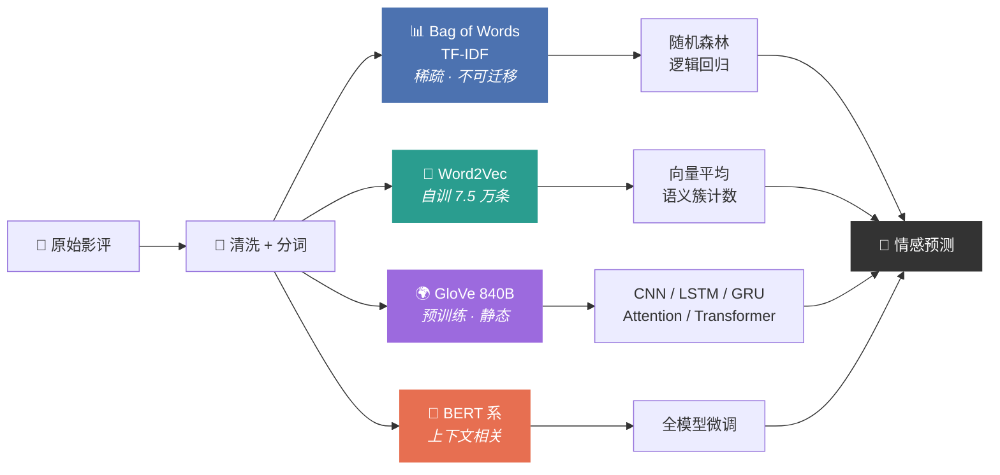

<div align="center">


# GYT · NLP Developing

**从词频统计到预训练模型 —— 一条完整可运行的 NLP 文本分类路径**

[](https://www.python.org/)
[](https://pytorch.org/)
[](https://scikit-learn.org/)
[](https://radimrehurek.com/gensim/)
[](https://www.kaggle.com/competitions/word2vec-nlp-tutorial)

</div>

---

## 项目目标

在同一份 IMDB 影评数据（25,000 条标注 / 25,000 条测试）上，用**完全一致的划分、
清洗和评测口径**跑通从最简单到最先进的一整条文本分类路径，并回答一个问题：

> 文本表示方法（词频 → 静态词向量 → 上下文词向量）和模型结构（线性 → CNN → RNN →
> Attention → Transformer）各自贡献了多少准确率？代价是多少参数和多少训练时间？

具体分两个阶段：

**阶段一 · Kaggle 入门教程复现**（`src/`、`notebooks/`）
Kaggle [Bag of Words Meets Bags of Popcorn](https://www.kaggle.com/competitions/word2vec-nlp-tutorial)
的 Python 3 完整复现。原教程写于 2014 年、基于 Python 2.7，代码在今天的环境里
已经跑不起来（`print` 语句、`sklearn.cross_validation`、gensim 3.x API 全部失效）。

**阶段二 · GloVe + 深度学习模型**（根目录 `imdb_*.py`）
用 Stanford GloVe 840B.300d 预训练词向量，训练 CNN / LSTM / GRU / CNN-LSTM /
Attention-LSTM / Transformer / Capsule-LSTM，以及微调 BERT / DistilBERT / RoBERTa，
统一记录准确率、训练时间和参数量。



## 实验结果对比表

统一口径：25,000 条标注影评按 8:2 **分层**划分（`random_state=42`），
20,000 训练 / 5,000 验证。神经网络共用 `pickle/imdb_glove.pickle3`，
定长填充 512，Embedding 用 GloVe 840B.300d 初始化并**冻结**。
GPU 为单卡 Tesla T4。表格由 `python tools/collect_results.py` 自动生成，
完整版见 [`results/comparison.md`](results/comparison.md)。

<!-- RESULTS_TABLE_START -->

| 模型 | 文本表示 | 验证集准确率 | 训练时间 | 参数量 | 可训练参数 | 最佳 epoch |
| --- | --- | --: | --: | --: | --: | --: |
| 传统分类器（随机森林） | Bag of Words (5,000 词频) | 0.8254 | 12 s | 5,000 | 5,000 | — |
| 传统分类器（逻辑回归） | TF-IDF (1-2gram, 200,000) | 0.8952 | 16 s | 200,000 | 200,000 | — |
| CNN | GloVe 840B.300d | 0.8876 | 98 s | 30,288,254 | 461,954 | 5 |
| LSTM | GloVe 840B.300d | 0.8894 | 293 s | 30,579,902 | 753,602 | 4 |
| GRU | GloVe 840B.300d | 0.8936 | 283 s | 30,391,742 | 565,442 | 7 |
| CNN-LSTM | GloVe 840B.300d | 0.8910 | 64 s | 30,140,798 | 314,498 | 4 |
| Attention-LSTM | GloVe 840B.300d | 0.8922 | 305 s | 30,728,702 | 902,402 | 4 |
| Transformer | GloVe 840B.300d | 0.8760 | 701 s | 31,168,326 | 1,342,026 | 4 |
| Capsule-LSTM | GloVe 840B.300d | 0.8920 | 250 s | 30,694,910 | 868,610 | 5 |
| BERT | bert-base-uncased 上下文词向量（全模型微调） | 0.9194 | 544 s | 109,483,778 | 109,483,778 | 3 |
| DistilBERT | distilbert-base-uncased 上下文词向量（全模型微调） | 0.9090 | 242 s | 66,955,010 | 66,955,010 | 3 |
| RoBERTa | roberta-base 上下文词向量（全模型微调） | 0.9292 | 555 s | 124,647,170 | 124,647,170 | 2 |

### 全部模型

- **准确率最高**：RoBERTa，0.9292
- **训练最快**：传统分类器（随机森林），12 秒
- **可训练参数最少**：传统分类器（随机森林），5,000
- **综合最好**：BERT（准确率 0.9194，训练 544 秒——在距最高准确率 1 个百分点以内的模型里训练时间最短）

### 只看神经网络模型

- **准确率最高**：RoBERTa，0.9292
- **训练最快**：CNN-LSTM，64 秒
- **可训练参数最少**：CNN-LSTM，314,498
- **综合最好**：BERT（准确率 0.9194，训练 544 秒——在距最高准确率 1 个百分点以内的模型里训练时间最短）

<!-- RESULTS_TABLE_END -->

### 测试集分数（25,000 条，模型从未见过）

上表是**验证集**的数字（用于选型）。Stanford aclImdb 的测试集标签是公开的，
所以本地就能算出真正的测试集分数——不用等 Kaggle 排行榜：

```bash
python tools/score_test.py --model all      # → results/test_scores.csv
```

| 模型 | 测试集准确率 | ROC-AUC |
|---|--:|--:|
| **RoBERTa** | **0.9371** | **0.9835** |
| BERT | 0.9190 | 0.9757 |
| DistilBERT | 0.9112 | 0.9712 |
| Capsule-LSTM | 0.9036 | 0.9648 |
| Attention-LSTM | 0.9026 | 0.9650 |
| CNN-LSTM | 0.8997 | 0.9637 |
| GRU | 0.8986 | 0.9630 |
| LSTM | 0.8975 | 0.9629 |
| CNN | 0.8858 | 0.9579 |
| Transformer | 0.8814 | 0.9540 |

测试集分数普遍比验证集高 0.5~1 个百分点。这不是异常——验证集只有 5,000 条，
本身有约 ±0.9% 的抽样波动，而测试集有 25,000 条，估计更稳。
排序和验证集完全一致，说明选型没有过拟合验证集。

### 提交到 Kaggle

竞赛的评价指标是 **ROC-AUC，不是准确率**，所以要交**正面概率**而不是 0/1 硬标签：

```bash
python tools/score_test.py --model roberta   # → results/roberta_submission_proba.csv
```

然后在竞赛页面 `Submit Predictions` 上传这个文件即可。

> ⚠️ 如果 `corpus/imdb/` 里放的是从 aclImdb 重建的 TSV，`id` 与 Kaggle 官方文件不同，
> **提交会被判为无效**。要上排行榜请先按上文「方式 A」下载官方 `testData.tsv`
> 覆盖进 `corpus/imdb/`，再重跑 `tools/score_test.py`——脚本会自动检测行数变化并重新编码。

### 阶段一的结果（Word2Vec 自训词向量）

| 方法 | 特征维度 | Accuracy | ROC-AUC |
|---|--:|--:|--:|
| Part 1 · Bag of Words + 随机森林 | 5,000 | 0.8394 | 0.9140 |
| Part 3-A · Word2Vec 向量平均 + 随机森林 | 300 | 0.7994 | 0.8782 |
| Part 3-B · Word2Vec 语义簇计数 + 随机森林 | 3,298 | 0.8292 | 0.9070 |
| Part 4 · TF-IDF (1-2gram) + 逻辑回归 | 200,000 | **0.8918** | **0.9576** |

> 阶段一用的是 `src/imdb.py` 的清洗流程（**去停用词**），阶段二为了和神经网络保持
> 完全一致而用 `common.review_to_wordlist`（**不去停用词**）。所以对比表里的
> `bow_rf` = 0.8254 与这里的 Part 1 = 0.8394 有差距，差异来自停用词处理，
> 不是实现不同。详见 [`docs/results.md`](docs/results.md)。

## 环境安装

```bash
git clone https://github.com/tguo0326/GYT-NLP-developing.git
cd GYT-NLP-developing

python -m venv .venv && source .venv/bin/activate     # Windows: .venv\Scripts\activate
pip install -r requirements.txt
```

**GPU（可选但强烈建议）**：`requirements.txt` 里的 `torch` 是 CPU 版。
要用 CUDA，按官网索引重装：

```bash
pip install torch --index-url https://download.pytorch.org/whl/cu121
python -c "import torch; print(torch.cuda.is_available(), torch.cuda.get_device_name(0))"
```

代码通过 `common.get_device()` 自动选择 CUDA / MPS / CPU，**没有 GPU 也能跑**，
只是 LSTM 系会慢 20~50 倍。阶段一（BoW / TF-IDF / Word2Vec）全程不需要 GPU。

**磁盘**：GloVe 准备阶段峰值占用约 10 GB（zip 2.1 GB + txt 5.3 GB + kv 2.5 GB），
转换完成后可以删掉 zip 和 txt，长期占用约 2.5 GB。

## 数据集与 GloVe 下载

### 1. IMDB 数据 → `corpus/imdb/`

需要三份文件：`labeledTrainData.tsv`、`testData.tsv`、`unlabeledTrainData.tsv`。

**方式 A · Kaggle 官方文件（要提交排行榜就用这个）**

```bash
# 先在 https://www.kaggle.com/competitions/word2vec-nlp-tutorial 点 Join Competition
pip install kaggle        # 并把 API token 放到 ~/.kaggle/kaggle.json
kaggle competitions download -c word2vec-nlp-tutorial -p corpus/imdb
cd corpus/imdb && unzip '*.zip' && cd ../..
```

**方式 B · 从公开的 Stanford aclImdb 语料重建（无需 Kaggle 账号）**

```bash
curl -O https://ai.stanford.edu/~amaas/data/sentiment/aclImdb_v1.tar.gz
tar xzf aclImdb_v1.tar.gz
python tools/make_local_dataset.py --imdb-dir aclImdb --output-dir corpus/imdb
```

Kaggle 的竞赛数据本来就是 aclImdb 的一个切分，列结构完全相同。
唯一区别是重建出的 `id` 沿用原始文件名（形如 `12345_9`），行顺序和 Kaggle 官方文件
不一致——**要提交排行榜请用方式 A**。

**检查数据**（任务 3：行数、字段、空值、标签对应）：

```bash
python tools/check_imdb_data.py
```

```text
=== corpus/imdb/labeledTrainData.tsv ===
  行数     : 25,000
  字段     : ['id', 'sentiment', 'review']
  评论长度 : 均值 233.8 词，中位数 174，最长 2470，最短 10
  标签分布 : 负面 12,500 / 正面 12,500
  ✓ 行数、字段、空值、id 唯一性、标签取值全部正常
```

### 2. GloVe 词向量 → `glove/`

```bash
wget -c -O glove/glove.840B.300d.zip https://nlp.stanford.edu/data/glove.840B.300d.zip
python tools/prepare_glove.py        # 自动解压 + 转成 Gensim 原生格式 + 自检
```

`tools/prepare_glove.py` 做三件事：

1. 解压 zip（5.3 GB 的 txt）；
2. 转成 Gensim 原生 `.kv` 格式。**不能直接用
   `KeyedVectors.load_word2vec_format(txt, no_header=True)`**——840B 这一份里有若干
   「词」本身包含空格，Gensim 按空格切分后要求恰好 301 段，会直接抛 `ValueError`。
   脚本自己解析：从右边取 300 个数当向量，剩下的整段当词（实测 2,196,017 行 0 异常）；
3. 自检：取向量、找相似词、算相似度、向量算术。

```text
词表大小 2,196,017，维度 300
movie      → movies(0.880), film(0.791), films(0.752), flick(0.719)
awful      → horrible(0.919), terrible(0.915), horrid(0.870), dreadful(0.831)
good ~ great = 0.8417    good ~ bad = 0.7355    movie ~ banana = 0.1742
king - man + woman → queen(0.775), prince(0.612), princess(0.602)
```

> `good ~ bad = 0.7355` 这个数字值得停一下：**反义词的余弦相似度很高**。
> 因为 GloVe 学的是「分布相似」——`good` 和 `bad` 出现在几乎相同的上下文里
> （`the movie was ___`）。这是所有静态词向量的固有特点，
> 也是情感分类不能只靠词向量余弦的原因。

三种表示方法的区别见 [`docs/glove-word2vec-bow.md`](docs/glove-word2vec-bow.md)。

## 文件放置位置

```text
GYT-NLP-developing/
├── corpus/imdb/                    # ← 放数据（.gitignore）
│   ├── labeledTrainData.tsv
│   ├── testData.tsv
│   └── unlabeledTrainData.tsv
├── glove/                          # ← 放词向量（.gitignore）
│   ├── glove.840B.300d.zip           · 下载的原始压缩包
│   ├── glove.840B.300d.txt           · 解压产物（转换完可删）
│   ├── glove.840B.300d.kv            · Gensim 原生格式
│   └── glove.840B.300d.kv.vectors.npy
├── pickle/imdb_glove.pickle3       # ← 预处理产物（.gitignore，312 MB）
├── models/                         # ← 最佳模型权重（.gitignore）
├── logs/                           # ← 训练日志（.gitignore）
├── results/                        # ← 对比表、history、提交文件
│
├── common.py                       # 所有模型共用的训练基础设施
├── hf_trainer.py                   # BERT 系微调的共用实现
├── imdb_process.py                 # 数据预处理 → pickle
├── imdb_bow_baseline.py            # 传统分类器基线
├── imdb_cnn.py  imdb_lstm.py  imdb_gru.py
├── imdb_cnnlstm.py  imdb_attention_lstm.py
├── imdb_transformer.py  imdb_capsule_lstm.py
├── imdb_bert_trainer.py  imdb_distilbert_trainer.py  imdb_roberta_trainer.py
│
├── src/                            # 阶段一：Kaggle 教程 Python 3 复现
├── notebooks/                      # 阶段一：可直接导入 Kaggle
├── tools/
│   ├── check_imdb_data.py          # 数据体检
│   ├── prepare_glove.py            # GloVe 转换 + 自检
│   ├── make_local_dataset.py       # 从 aclImdb 重建竞赛格式数据
│   ├── collect_results.py          # 汇总 results/*_summary.json → 对比表
│   └── build_notebooks.py
├── docs/
│   ├── glove-word2vec-bow.md       # GloVe / Word2Vec / BoW 的区别
│   ├── troubleshooting.md          # 遇到的问题及解决办法（24 条）
│   ├── learning-summary.md         # 学习总结
│   ├── results.md                  # 阶段一完整实测数据
│   ├── from-bow-to-llm.md          # 概念脉络：One-Hot → BoW → Word2Vec → LLM
│   ├── kaggle-gpu.md               # Kaggle 免费算力笔记
│   └── original_code/              # 压缩包里的原始脚本（未修改，备查）
├── extras/                         # 不在任务清单里的原始脚本（未修改）
└── tests/                          # pytest：清洗逻辑 + 模型前向
```

## 完整运行顺序

```bash
# ── 0. 环境 ───────────────────────────────────────────────
pip install -r requirements.txt

# ── 1. 数据（见上文「数据集与 GloVe 下载」）────────────────
python tools/check_imdb_data.py              # 确认三份 TSV 没问题

# ── 2. GloVe ─────────────────────────────────────────────
python tools/prepare_glove.py                # 解压 + 转换 + 自检（约 6 分钟）

# ── 3. 预处理 ────────────────────────────────────────────
python imdb_process.py                       # → pickle/imdb_glove.pickle3（约 1 分钟）

# ── 4. 传统基线 ───────────────────────────────────────────
python imdb_bow_baseline.py                  # BoW+RF 与 TF-IDF+LR

# ── 5. 神经网络（按任务清单顺序）───────────────────────────
python imdb_cnn.py                           # 任务 7
python imdb_lstm.py                          # 任务 8
python imdb_gru.py                           # 任务 9
python imdb_cnnlstm.py                       # 任务 10-A
python imdb_attention_lstm.py                # 任务 10-B（输出注意力权重）

# ── 6. 选做 ──────────────────────────────────────────────
python imdb_transformer.py
python imdb_capsule_lstm.py
python imdb_distilbert_trainer.py            # 三个 BERT 系里最快，建议先跑这个
python imdb_bert_trainer.py
python imdb_roberta_trainer.py

# ── 7. 汇总 ──────────────────────────────────────────────
python tools/collect_results.py              # → results/comparison.md
python -m pytest tests/ -q                   # 37 项测试
```

每个脚本跑完会产出四样东西：

| 产物 | 位置 |
|---|---|
| 训练日志（每 epoch 的 train/val loss 与 accuracy） | `logs/<name>.log` |
| 逐 epoch 指标 CSV | `results/<name>_history.csv` |
| 汇总 JSON（准确率、参数量、训练时间） | `results/<name>_summary.json` |
| 最佳模型权重（按验证准确率） | `models/<name>_best.pt` |
| Kaggle 提交文件 | `results/<name>_submission.csv` |

## 每个模型的运行命令

所有 GloVe 模型共用同一套命令行参数（`common.build_parser`）：
`--epochs` `--batch-size` `--lr` `--seed` `--clip` `--predict` `--no-submission`。

| 模型 | 命令 | 要点 |
|---|---|---|
| 传统基线 | `python imdb_bow_baseline.py` | `--only bow_rf` 只跑其中一个 |
| **CNN** | `python imdb_cnn.py` | 多尺度卷积 `--filter-sizes 3 4 5` |
| **LSTM** | `python imdb_lstm.py` | `--num-hiddens 120 --num-layers 2`；`--unidirectional` 做单向对照 |
| **GRU** | `python imdb_gru.py` | 与 LSTM 脚本结构、超参、种子完全一致，只换 `nn.GRU` |
| **CNN-LSTM** | `python imdb_cnnlstm.py` | `--pooling-size 2` 把序列压到 256 |
| **Attention-LSTM** | `python imdb_attention_lstm.py` | `--show-attention 6 --top-words 12` 导出注意力权重 |
| Transformer | `python imdb_transformer.py` | `--num-heads 6 --num-layers 2`，`lr` 默认 3e-4 |
| Capsule-LSTM | `python imdb_capsule_lstm.py` | `--num-capsule 8 --dim-capsule 16 --routings 3` |
| DistilBERT | `python imdb_distilbert_trainer.py` | 6 层，最快 |
| BERT | `python imdb_bert_trainer.py` | `--batch-size 16 --lr 2e-5` |
| RoBERTa | `python imdb_roberta_trainer.py` | `--lr 1e-5`（更大会塌） |

### 对一条新评论做预测

任何模型训练完之后，都可以用 `--predict` 载入最佳权重直接预测，不重新训练：

```bash
python imdb_cnn.py --predict "This film was a masterpiece from start to finish."
python imdb_gru.py --predict "Terrible pacing." "Absolutely loved every minute."
python imdb_distilbert_trainer.py --predict "A quietly devastating film."
```

```text
INFO [positive p=0.9987] This film was a masterpiece from start to finish.
```

### Attention 权重：模型在看哪些词

`imdb_attention_lstm.py` 训练结束会把注意力权重写进
`results/attention_lstm_attention.json`，并在日志里打印高权重词：

```text
[positive p=0.9962] This movie was absolutely wonderful. The acting was superb ...
  高权重词: wonderful(0.1667), absolutely(0.1497), superb(0.1296), acting(0.0916)

[negative p=0.0013] A complete waste of time. Terrible script, wooden acting ...
  高权重词: waste(0.1243), terrible(0.1172), of(0.1035), time(0.1016), wooden(0.0582)
```

模型确实把权重压在情感词上（`wonderful` / `superb` / `waste` / `terrible` / `wooden`），
而不是均匀分给 500 个位置——这就是早期 Attention 相对「最终隐藏状态」的价值：
**既缓解了信息瓶颈，又顺带给出了可解释性**。

## 遇到的问题及解决办法

完整的 24 条记录在 **[`docs/troubleshooting.md`](docs/troubleshooting.md)**，
这里列最关键的几类：

**跑不起来的（直接报错）**

| 问题 | 解决 |
|---|---|
| `imdb_process.py` 写死 `g:\lib\glove.840B.300d.gensim.txt` | 改相对路径 `glove/` |
| `pickle/`、`result/` 目录不存在，跑到最后一行才崩 | `common.setup()` 提前创建 |
| `imdb_cnn.py` 读 `imdb_demo_glove.pickle3`，实际产出是 `imdb_glove.pickle3` | 统一文件名 |
| `device = torch.device('cuda:0')` + `.cuda()` 写死 | `common.get_device()` 自动选择 |
| Gensim 读不了原始 `glove.840B.300d.txt`（有含空格的词） | 自己解析：右边 300 个数当向量 |
| `datasets.load_metric` / `evaluation_strategy` / `Trainer(tokenizer=)` 已移除或改名 | 见 troubleshooting 第三节 |

**跑得通但训不出来的（最难发现）**

| 问题 | 后果 | 解决 |
|---|---|---|
| 序列填到 512，`states[-1]` 读的全是 PAD | 句尾信息被三百多个 PAD 冲掉 | `pack_padded_sequence` |
| CNN-LSTM `permute([1,0,2])` 把**卷积核维度当成时间步** | LSTM 在无序集合上做顺序建模，组合模型失去意义 | 改成 `(batch, seq', num_filter)` |
| Attention `softmax(dim=1)` 归一化到 **batch 维** | batch_size 一改结果就变；且加权后没求和，算完就被丢掉 | 沿时间轴归一化 + `bmm` 加权求和 |
| Capsule 的 `squash` 写成纯 L2 归一化 | 所有胶囊长度都变成 1，「置信度」信息被抹平 | `‖s‖²/(1+‖s‖²)·s/‖s‖` |
| Transformer 的 `review_to_wordlist` 返回字符串 | `Vocab.build` **逐字符**建词表，词表退化成 26 个字母 | 重写该脚本 |
| `train_loss += loss` 累加带计算图的张量 | 显存单调增长直到 OOM | `loss.item() * batch_size` |
| 没有 `model.eval()` | 验证时 Dropout 仍在丢神经元，准确率被低估且每次不同 | `common._run_epoch` 自动切换 |
| 用最后一个 epoch 的权重预测 | 实测 CNN 第 5 epoch 最好（0.8876），第 10 已掉到 0.8850 | 按 `val_acc` 保存最佳权重 |

这几条都有对应的回归测试钉住（`tests/test_models.py`，37 项）：

```bash
python -m pytest tests/ -v
```

**评测口径**

- OOV 率按**词型**算是 22.23%，按**词次**算只有 0.43%——报 OOV 必须说清口径；
- 三个 BERT 脚本原本 `train_test_split` 连 `random_state` 都没有，每次划分都不同，
  跨模型完全不可比。现在全项目统一 `random_state=42, stratify=y`；
- `read_csv` 必须显式 `quoting=csv.QUOTE_NONE`：影评里全是英文引号，
  按默认规则解析会**行数正常但内容错位**。

## 关于 Kaggle 免费 GPU

阶段一（BoW / TF-IDF / Word2Vec）**全程不需要 GPU**，开了也一秒不省——
主要计算是字符串哈希、稀疏计数和决策树分裂，不是稠密矩阵乘法。

阶段二就完全不同了。同样的数据在 Tesla T4 上：CNN 一个 epoch 约 10 秒，
双向 LSTM 约 29 秒，Transformer 约 70 秒；换到 CPU 会慢 20~50 倍。
**这是 GPU 真正开始起作用的分界线。**

Kaggle 的免费额度（GPU 每周 30 小时、TPU 20 小时，需先完成手机验证）、
开启步骤和省额度技巧，整理在 [`docs/kaggle-gpu.md`](docs/kaggle-gpu.md)。

## 延伸阅读

- 📊 **[实验结果对比表](results/comparison.md)** —— 自动生成，11 个模型的准确率 / 时间 / 参数量
- 🔤 **[GloVe、Word2Vec 与 Bag of Words 的区别](docs/glove-word2vec-bow.md)** ——
  局部 vs 全局训练目标，以及为什么自训 Word2Vec 打不过词频统计
- 🛠 **[遇到的问题及解决办法](docs/troubleshooting.md)** —— 24 条，含「不报错但训不出来」的一整类
- 🎓 **[学习总结](docs/learning-summary.md)** —— 从这个项目里真正学到的东西
- 📖 **[从 Bag of Words 到大模型 Embedding](docs/from-bow-to-llm.md)** ——
  One-Hot 为什么不够用、静态向量的三个局限、ELMo 的分水岭意义
- 📈 **[阶段一完整实测结果](docs/results.md)** —— K-Means 聚类抽查、为什么语义簇计数好于向量平均
- ⚡ **[Kaggle 算力笔记](docs/kaggle-gpu.md)**

## 参考

- [Kaggle · Bag of Words Meets Bags of Popcorn](https://www.kaggle.com/competitions/word2vec-nlp-tutorial)
- Maas et al., 2011. [Learning Word Vectors for Sentiment Analysis](https://aclanthology.org/P11-1015/) —— IMDB 数据集原论文
- Mikolov et al., 2013. [Efficient Estimation of Word Representations in Vector Space](https://arxiv.org/abs/1301.3781) —— Word2Vec
- Pennington et al., 2014. [GloVe: Global Vectors for Word Representation](https://aclanthology.org/D14-1162/)
- Kim, 2014. [Convolutional Neural Networks for Sentence Classification](https://aclanthology.org/D14-1181/) —— TextCNN
- Yang et al., 2016. [Hierarchical Attention Networks for Document Classification](https://aclanthology.org/N16-1174/) —— 本项目 Attention 的打分函数
- Vaswani et al., 2017. [Attention Is All You Need](https://arxiv.org/abs/1706.03762)
- Devlin et al., 2019. [BERT: Pre-training of Deep Bidirectional Transformers](https://aclanthology.org/N19-1423/)
- Sanh et al., 2019. [DistilBERT](https://arxiv.org/abs/1910.01108) · Liu et al., 2019. [RoBERTa](https://arxiv.org/abs/1907.11692)
- Sabour et al., 2017. [Dynamic Routing Between Capsules](https://arxiv.org/abs/1710.09829)

---

<div align="center">
<sub>数据集遵循 Stanford AI Lab 使用条款 · 本仓库代码用于学习目的</sub>
</div>
